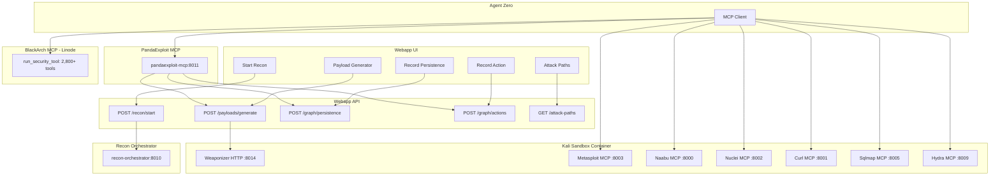
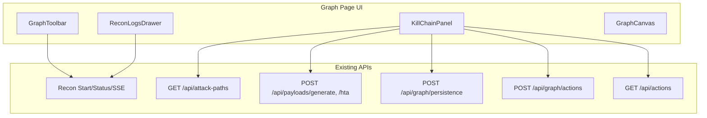

# Cyber Kill Chain UI Extension Plan

## Context

The [Agent Zero Cyber Kill Chain Operator plan](agent_zero_cyber_kill_chain_operator_2d4e5f9e.plan.md) extended Agent Zero and the graph. The UI still shows only "Start Recon" and "Reconnaissance Logs." This plan extends the UI to expose the full kill chain without modifying the recon process.

**Recon remains unchanged**: The 7-phase recon pipeline (Domain Discovery through GitHub Secret Hunt) stays as-is. "Start Recon" continues to trigger it. This plan adds UI around it.

---

## Tools and Execution Model by Kill Chain Stage

All tools run in Docker. No local host execution. Invocation paths: **Recon container** (orchestrator-spawned), **Kali MCP servers** (Agent Zero via MCP), **BlackArch MCP** (Agent Zero via MCP, Linode, 2,800+ tools, 30-min timeout), **Webapp REST API** (UI or PandaExploit MCP), **PandaExploit MCP** (Agent Zero, bridges to webapp/recon).

| KC Stage                       | Recon Container                  | Kali MCPs                           | BlackArch MCP                                                                 | Metasploit / Webapp                 |
| ------------------------------ | -------------------------------- | ----------------------------------- | ---------------------------------------------------------------------------- | ----------------------------------- |
| **1. Reconnaissance**          | `start_recon`, WHOIS, crt.sh, Knockpy, Naabu, httpx, Katana, GAU, Kiterunner, Nuclei, GitHub Secret Hunter | `execute_naabu`, `execute_nmap`, `execute_nuclei`, etc. | `run_security_tool(nmap, nuclei, subfinder, amass, theharvester, httpx, masscan, naabu, dnsx, gau, ...)` | —                                   |
| **2. Weaponization**           | —                                | —                                   | —                                                                            | `generate_payload` (weaponizer)      |
| **3. Delivery**                | —                                | —                                   | —                                                                            | `start_web_delivery` (MSF)           |
| **4. Exploitation**            | —                                | `execute_sqlmap`, `execute_hydra`, etc. | `run_security_tool(sqlmap, hydra, commix)`                                   | `metasploit_console`                |
| **5. Installation**            | —                                | —                                   | —                                                                            | `run_post_module`, `record_persistence` |
| **6. C2**                      | —                                | —                                   | —                                                                            | `start_listener` (MSF)               |
| **7. Actions on Objectives**   | —                                | —                                   | —                                                                            | `record_action`                     |

**Where BlackArch MCP runs:** Linode (`http://66.228.39.20:8080/sse`). Single MCP exposes 2,800+ tools via `run_security_tool(tool_name, arguments)`. Execution limit: 30 minutes. See [BlackArch Offensive Tools Table](blackarch-offensive-tools-table.md).

### BlackArch MCP Tools by Kill Chain Stage

| KC Stage                     | BlackArch Tools                                                                                                                                  | Notes                                                                    |
| ---------------------------- | ------------------------------------------------------------------------------------------------------------------------------------------------ | ------------------------------------------------------------------------ |
| **1. Reconnaissance**        | nmap, naabu, nuclei, subfinder, amass, theharvester, httpx, whatweb, assetfinder, dnsx, gau, waybackurls, recon-ng, fierce, masscan, aircrack-ng   | A0 confirmed: nmap, aircrack-ng. nuclei/hydra pending full catalog crawl |
| **2. Weaponization**         | (msfvenom via Kali weaponizer; BlackArch has metasploit but binary is msfconsole)                                                                | Prefer Kali weaponizer for payload gen                                   |
| **3. Scanning/Enumeration**  | nikto, sqlmap, ffuf, gobuster, dirsearch, wpscan, feroxbuster, arjun                                                                              | A0 confirmed: sqlmap, ffuf                                               |
| **4. Exploitation**         | sqlmap, hydra, commix                                                                                                                            | A0 confirmed: sqlmap, metasploit                                         |
| **5. Mobile/Forensics**      | androguard, apktool, apkid, autopsy, afflib, aeskeyfind                                                                                           | From A0 discovery                                                        |
| **6. C2**                    | (Metasploit MCP for listeners)                                                                                                                   | BlackArch has metasploit; prefer Kali MSF for interactive                 |
| **7. Actions on Objectives** | record_action via PandaExploit MCP                                                                                                               | No BlackArch-specific tool                                               |

### Execution Architecture

### Summary: Invocation Paths

| Invocation                    | Path                                                                |
| ----------------------------- | ------------------------------------------------------------------- |
| **Recon UI**                  | Webapp → recon-orchestrator → recon container (no MCP)              |
| **Kali tools**                | Agent Zero → Kali MCP (SSE) → CLI tool in kali-sandbox              |
| **BlackArch tools**           | Agent Zero → BlackArch MCP (SSE) → run_security_tool in Linode container |
| **Weaponization**             | UI or Agent Zero → webapp API → weaponizer HTTP (kali-sandbox:8014) |
| **Metasploit**                | Agent Zero → Metasploit MCP (SSE) → msfconsole in kali-sandbox      |
| **Record persistence/action** | UI or Agent Zero → webapp API → Neo4j                               |

### What the UI Can Do Directly vs Via Agent Zero

| Action                                  | UI Direct                               | Agent Zero                    |
| --------------------------------------- | --------------------------------------- | ----------------------------- |
| Start recon                             | Yes (POST recon-orchestrator)           | Yes (PandaExploit MCP)        |
| Generate payload                        | Yes (POST /api/payloads/* → weaponizer) | Yes (PandaExploit MCP → same) |
| View attack paths                       | Yes (GET /api/attack-paths)             | Yes (PandaExploit MCP)        |
| Record persistence                      | Yes (POST /api/graph/persistence)       | Yes (PandaExploit MCP)        |
| Record action                           | Yes (POST /api/graph/actions)           | Yes (PandaExploit MCP)        |
| Start listener / web delivery           | No (Metasploit MCP only)                | Yes (Metasploit MCP)          |
| Run exploits (Metasploit, sqlmap, etc.) | No (Kali/BlackArch MCPs only)           | Yes (Kali MCPs, BlackArch MCP) |
| Run post modules                        | No (Metasploit MCP only)                | Yes (Metasploit MCP)          |

#### When to Use BlackArch vs Kali MCPs

**Full reference:** [TOOL_ROUTING_STRATEGY.md](TOOL_ROUTING_STRATEGY.md)

| Condition | Use Kali MCP | Use BlackArch MCP |
|-----------|--------------|-------------------|
| Tool is `metasploit_console` | Always | Never |
| Tool in Kali AND quick scan (< 5 min) | Prefer | Fallback if Kali fails |
| Tool in Kali AND long scan (sqlmap, full nuclei, large nmap) | Fallback | Prefer (30-min timeout) |
| Kali MCP unreachable | — | Use BlackArch for overlapped tools |
| Tool NOT in Kali (subfinder, amass, wpscan, feroxbuster, etc.) | — | Use BlackArch |

**Tool Routing Summary by Stage:**

| Stage | Kali MCP | BlackArch MCP |
|-------|----------|---------------|
| 1. Reconnaissance | execute_naabu, execute_nmap, execute_nuclei (quick) | run_security_tool(nmap, nuclei, subfinder, amass, theharvester, httpx, masscan, naabu, ...) for long scans or BlackArch-only tools |
| 4. Exploitation | execute_sqlmap, execute_hydra (quick), metasploit_console | run_security_tool(sqlmap, hydra, commix) for long scans |
| 2, 3, 5, 6, 7 | — | PandaExploit MCP (weaponization, record_*) or Metasploit MCP (delivery, C2) |

For stages 3, 4, 6 (Delivery, Exploitation, C2), the UI guides the user to Agent Zero; it cannot invoke Metasploit or Kali tools directly.

---

## Architecture

---

## Part 1: Kill Chain Status Panel

**Location**: New component in the Graph page, below the toolbar or in a collapsible sidebar. Renders only when `projectId` is set.

**Behavior**:

- Derive current stage from graph + recon status:
  - **Stage 1 (Reconnaissance)**: Recon running or graph empty
  - **Stage 2+**: Graph has nodes; show highest reached stage from Exploit, Persistence, Action nodes
- Display 7 stages with checkmarks for completed, highlight for current
- "Next step" hint: e.g. "Recon complete. View attack paths or generate payload."

**Data**:

- `reconStatus` (already in page)
- `data?.nodes` (already in page) — count Exploit, Persistence, Action
- No new API

**Files**:

- New: webapp/src/app/graph/components/KillChainPanel/KillChainPanel.tsx
- New: webapp/src/app/graph/components/KillChainPanel/KillChainPanel.module.css
- Edit: webapp/src/app/graph/page.tsx — add KillChainPanel, pass `reconStatus`, `data`, `projectId`

---

## Part 2: Post-Recon Actions (Toolbar + Panel)

**2.1 Add "Kill Chain" dropdown to GraphToolbar**

- New dropdown next to "Start Recon" (or replace single button with "Actions" dropdown)
- Options:
  - **Start Recon** (existing) — unchanged
  - **View Attack Paths** — opens AttackPathsDrawer
  - **Generate Payload** — opens PayloadGeneratorModal
  - **Record Persistence** — opens RecordPersistenceModal
  - **Record Action** — opens RecordActionModal

**2.2 Attack Paths Drawer**

- Fetch `GET /api/attack-paths?projectId=X&limit=5`
- Display ranked list: name, severity, target, metasploit hint

**Files**:

- New: webapp/src/app/graph/components/AttackPathsDrawer/AttackPathsDrawer.tsx
- Edit: webapp/src/app/graph/components/GraphToolbar/GraphToolbar.tsx — add dropdown, callbacks for actions

**2.3 Payload Generator Modal**

- Form: payload type (windows_meterpreter_reverse_tcp, windows_shell_reverse_tcp, etc.), lhost, lport, format
- Call `POST /api/payloads/generate` or `POST /api/payloads/hta` (for HTA)
- Show result: base64 payload or download link

**Files**:

- New: webapp/src/app/graph/components/PayloadGeneratorModal/PayloadGeneratorModal.tsx
- Edit: webapp/src/app/graph/page.tsx — state for modal open/close

**2.4 Record Persistence Modal**

- Form: session_id, method, target_ip, module, path, trigger, report (optional)
- Call `POST /api/graph/persistence` with projectId, userId, body
- Requires: projectId, userId, sessionId, method, targetIp

**Files**:

- New: webapp/src/app/graph/components/RecordPersistenceModal/RecordPersistenceModal.tsx

**2.5 Record Action Modal**

- Form: action_type (exfil, lateral_movement, objective, etc.), target_ip, description
- Call `POST /api/graph/actions` with projectId, userId, body
- Requires: projectId, userId, actionType, targetIp

**Files**:

- New: webapp/src/app/graph/components/RecordActionModal/RecordActionModal.tsx

---

## Part 3: Recon Logs Label Clarification

- Rename "Reconnaissance Logs" to "Recon Logs (Stage 1)" or add subtitle: "Stage 1: Reconnaissance"
- Keep "Phase 1/7 … Phase 7/7" as-is (recon phases)

**File**: webapp/src/app/graph/components/ReconLogsDrawer/ReconLogsDrawer.tsx

---

## Part 4: Agent Zero Deep Links for Delivery/C2

- No new REST APIs for Metasploit (start_listener, start_web_delivery) — MCP-only
- Add "Start Web Delivery" and "Manage Listeners" buttons that open Agent Zero iframe with a pre-filled prompt, e.g.:
  - Start Web Delivery: `Start web delivery for LHOST=YOUR_IP LPORT=4444`
  - Manage Listeners: `List active listeners`

**Implementation**: Pass `initialPrompt` or `suggestedAction` query param to Agent Zero iframe URL. If Agent Zero supports it, use it; otherwise use a KillChainPanel hint: "Open Agent Zero and use: start_web_delivery(lhost, lport)"

**File**: webapp/src/app/graph/components/A0Panel/A0Panel.tsx — if Agent Zero accepts `initial_prompt` in URL, pass it; else document in UI

---

## Part 5: WEAPONIZER_URL for Docker

- Webapp payload API uses `http://localhost:8014` by default; in Docker it must reach kali-sandbox.
- Add to webapp env in docker-compose: `WEAPONIZER_URL: http://kali-sandbox:8014`

**File**: docker-compose.yml — webapp environment section

---

## Part 6: Kill Chain Panel "Next Steps" Logic

| Stage | Condition                       | Next Step Hint                                       |
| ----- | ------------------------------- | ---------------------------------------------------- |
| 1     | Recon running                   | "Recon in progress..."                               |
| 1     | Recon idle, graph empty         | "Start Recon to discover targets"                    |
| 2     | Recon complete, graph has nodes | "View attack paths" or "Generate payload"            |
| 3     | Has attack paths                | "Open Agent Zero to start listener and web delivery" |
| 4     | -                               | "Open Agent Zero to exploit"                         |
| 5     | Has Exploit nodes               | "Record persistence after session"                   |
| 6     | -                               | "Open Agent Zero to manage listeners"                |
| 7     | Has Persistence/Action          | "Record actions on objectives"                       |

---

## Implementation Order

| #   | Task                                           | Files                           |
| --- | ---------------------------------------------- | ------------------------------- |
| 1   | Add WEAPONIZER_URL to webapp in docker-compose | docker-compose.yml              |
| 2   | Create KillChainPanel component                | KillChainPanel.tsx, .module.css |
| 3   | Add KillChainPanel to Graph page               | page.tsx                        |
| 4   | Add Actions dropdown to GraphToolbar           | GraphToolbar.tsx                |
| 5   | Create AttackPathsDrawer                       | AttackPathsDrawer.tsx           |
| 6   | Create PayloadGeneratorModal                   | PayloadGeneratorModal.tsx       |
| 7   | Create RecordPersistenceModal                  | RecordPersistenceModal.tsx      |
| 8   | Create RecordActionModal                       | RecordActionModal.tsx           |
| 9   | Wire modals/drawers in page.tsx                | page.tsx                        |
| 10  | Add "Stage 1" subtitle to ReconLogsDrawer      | ReconLogsDrawer.tsx             |

---

## Appendix: Agent Zero BlackArch Discovery Findings

- **Catalog size:** 200+ tools discovered (crawl toward 2,800+)
- **Confirmed tools:** nmap, ffuf, aircrack-ng, sqlmap, metasploit, androguard, apktool, apkid, autopsy, afflib, aeskeyfind
- **Pagination:** `list_blackarch_tools` returns max 100 per query; use targeted queries (e.g. `list_blackarch_tools("nuclei")`) or `verify_tool_available(tool_name)` for specific tools
- **Execution limit:** 30 minutes (`BLACKARCH_TOOL_TIMEOUT=1800`)
