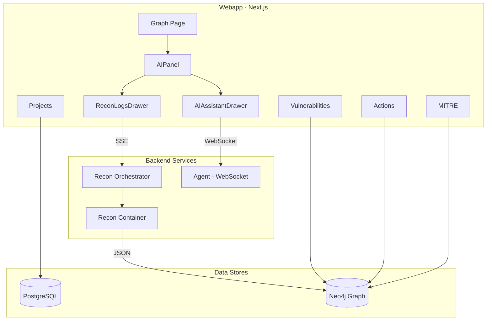

# PandaExploit Platform Overview

This document describes how the PandaExploit platform works today and proposes six strategic enhancements. PandaExploit is an AI-powered agentic red team framework that automates offensive security operations—from reconnaissance to exploitation to post-exploitation—with minimal human intervention.

---

## Part I: Current Platform

### 1. Reconnaissance

**Purpose:** Automated OSINT and vulnerability scanning combining multiple security tools for comprehensive target assessment.

**Architecture:**

- The **Recon Orchestrator** (Python) manages the lifecycle of recon containers.
- The webapp triggers recon via `POST /api/recon/:projectId/start`.
- Logs stream in real time via Server-Sent Events (SSE) at `/api/recon/:projectId/logs`.
- Status is polled via `GET /api/recon/:projectId/status`.

**Phases (7):**

1. Domain Discovery  
2. Port Scanning  
3. HTTP Probing  
4. Resource Enumeration  
5. Vulnerability Scanning  
6. MITRE Enrichment  
7. GitHub Secret Hunt  

**Tools:** Naabu, httpx, Katana, GAU, Kiterunner, Nuclei, Wappalyzer. All are configured via Project settings fetched from `GET /api/projects/:projectId`.

**Output:** JSON written to `recon/output/`; optionally pushed to the Neo4j graph via `update_graph_from_json`.

**Key files:**

- [recon/main.py](../recon/main.py) — Recon pipeline entry point  
- [recon_orchestrator/api.py](../recon_orchestrator/api.py) — Container lifecycle and log streaming  
- [webapp/src/hooks/useReconSSE.ts](../webapp/src/hooks/useReconSSE.ts) — SSE log streaming hook  
- [webapp/src/hooks/useReconStatus.ts](../webapp/src/hooks/useReconStatus.ts) — Status polling hook  

---

### 2. AI Chat (Agent)

**Purpose:** Conversational AI that queries the graph, runs tools (Metasploit, naabu, curl, etc.), and guides exploitation.

**Connection:**

- WebSocket to the agent service (e.g. `ws://agent:8080/ws/agent`).
- `useAgentWebSocket` connects with `userId`, `projectId`, and `sessionId`.

**Phases:**

- **Informational** — Answer questions, query graph, gather context.
- **Exploitation** — CVE exploit or brute-force credential guess attack paths.
- **Post-Exploitation** — Actions after successful exploitation.

**Recon integration (Phases 1–3):**

- **Live Recon run capsule** — Shows status and phase in Chat when recon is running.
- **Explain this** — Select log lines in Recon Logs and click "Ask AI"; answer appears in Chat.
- **View in Recon** — Deep link from Chat citations to Recon tab with highlighted log lines.
- **Start/Stop recon** — Run controls in the Chat Run capsule.

**Key files:**

- [webapp/src/app/graph/components/AIAssistantDrawer/AIAssistantDrawer.tsx](../webapp/src/app/graph/components/AIAssistantDrawer/AIAssistantDrawer.tsx) — Chat UI  
- [webapp/src/hooks/useAgentWebSocket.ts](../webapp/src/hooks/useAgentWebSocket.ts) — WebSocket hook  
- [agentic/websocket_api.py](../agentic/websocket_api.py) — Agent WebSocket handler  

---

### 3. Graph (Neo4j)

**Purpose:** Attack-surface map connecting domains, subdomains, IPs, ports, services, BaseURLs, endpoints, parameters, technologies, vulnerabilities, CVEs, and MITRE CWE/CAPEC.

**Schema:**

- **Domain** is the root node for all queries.
- All nodes include `user_id` and `project_id` for tenant isolation.
- Composite indexes on `(user_id, project_id)` enable efficient tenant-scoped queries.

**Key node types:** Domain, Subdomain, IP, Port, Service, BaseURL, Endpoint, Parameter, Technology, Vulnerability, CVE, MitreData, Capec, DNSRecord, Header, Exploit.

**Relationships:** HAS_SUBDOMAIN, RESOLVES_TO, HAS_PORT, RUNS_SERVICE, SERVES_URL, HAS_ENDPOINT, HAS_PARAMETER, FOUND_AT, AFFECTS_PARAMETER, USES_TECHNOLOGY, HAS_KNOWN_CVE, HAS_MITRE_DATA, RELATED_CAPEC.

**Key files:**

- [graph_db/readmes/GRAPH.SCHEMA.md](../graph_db/readmes/GRAPH.SCHEMA.md) — Full schema documentation  
- [webapp/src/app/api/graph/route.ts](../webapp/src/app/api/graph/route.ts) — Graph API  
- [graph_db/update_graph_from_json.py](../graph_db/update_graph_from_json.py) — JSON-to-graph import  

---

### 4. Vulnerabilities

**Sources:**

- Nuclei (DAST) — Active vulnerability scanning.
- CVE lookup from detected technologies.
- GVM (Greenbone Vulnerability Manager) — If configured.
- Security checks — Missing headers, TLS issues, exposed services, etc.

**Storage:** Neo4j `Vulnerability` nodes linked to Endpoint (FOUND_AT) and Parameter (AFFECTS_PARAMETER).

**Properties:** template_id, severity, category, matched_at, curl_command, raw_request, raw_response, fuzzing_parameter, matched_ip.

**UI:** [/vulnerabilities](../webapp/src/app/vulnerabilities/page.tsx) page; filtered by project.

---

### 5. MITRE ATT&CK Mapping

**Scope:** CWE/CAPEC enrichment only—not ATT&CK techniques. Per [recon/readmes/README.MITRE.md](../recon/readmes/README.MITRE.md), ATT&CK mappings are intentionally excluded because generic parent CWE mappings often produce inaccurate technique associations.

**Flow:** CVE → CWE hierarchy (MitreData) → CAPEC attack patterns.

**Data:** `recon/data/mitre_db/`; CVE2CAPEC mappings.

**Graph:** CVE -[:HAS_MITRE_DATA]-> MitreData -[:RELATED_CAPEC]-> Capec.

**UI:** [/mitre](../webapp/src/app/mitre/page.tsx) page.

---

### 6. Action Logs

**Purpose:** Audit trail of recon, vulnerability, agent, and user actions.

**Storage:** Neo4j `ActionLog` nodes with `project_id`, `user_id`, `type`, `action`, `description`, `status`, `metadata`, `timestamp`.

**Types:** recon, vulnerability, agent, user, other.

**Creation:** Recon completion via `useReconSSE`; explicit events via `POST /api/actions/create`.

**UI:** [/actions](../webapp/src/app/actions/page.tsx); filters by type and status.

**Key files:**

- [webapp/src/lib/actionLog.ts](../webapp/src/lib/actionLog.ts) — ActionLog helper (Neo4j)  
- [webapp/src/app/api/actions/route.ts](../webapp/src/app/api/actions/route.ts) — Actions API  
- [webapp/src/app/api/actions/create/route.ts](../webapp/src/app/api/actions/create/route.ts) — Create action API  

---

### 7. Projects and Users

**Model:** PostgreSQL via Prisma.

- **User:** id, name, email; has many Projects.
- **Project:** id, userId, name, description, plus 169+ configurable fields (target, scan modules, nuclei, katana, agent behavior, etc.).

**Key files:**

- [webapp/prisma/schema.prisma](../webapp/prisma/schema.prisma) — Data model  
- [webapp/src/app/api/projects/](../webapp/src/app/api/projects/) — Projects API  

---

### 8. Target Creation and Required Values

**Required:**

- `name` — Project name.
- `targetDomain` — Primary domain (e.g. `example.com`). Do not include `http://` or paths; used as the recon starting point.

**Target fields** (from [TargetSection.tsx](../webapp/src/components/projects/ProjectForm/sections/TargetSection.tsx) and Prisma):

| Field | Description |
|-------|-------------|
| **targetDomain** | Primary domain (e.g. `example.com`); strips `http://`/`https://` if entered. |
| **subdomainList** | Comma-separated prefixes (e.g. `www, api, admin`); stored with trailing dots; empty = discover all subdomains. |
| **Include root domain** | Toggle to also scan the root domain (e.g. `example.com`). |
| **verifyDomainOwnership** | Optional; use `ownershipToken` and `ownershipTxtPrefix` for TXT record verification. |

**Optional:** `description`; scan modules, nuclei severity, katana depth, and hundreds of other options in project settings.

---

### Architecture Diagram

---

## Part II: Proposed Enhancements

### Enhancement 1: Evidence Chain and Traceability

**Concept:** Connect every finding to its source (log lines, recon phase, tool output). Provide a clear chain from recon → finding → exploit → impact.

**Implementation:**

- Link graph nodes to `eventId`-keyed log events.
- Store evidence chain (recon phase, tool output, matched log line).
- Add "View evidence" from graph nodes to jump to the source.

**Value:** Compliance, trust, and justification for findings. Essential for reports and audits.

---

### Enhancement 2: Recon Guidance from Chat

**Concept:** Mid-run commands like "Focus on SQLi" or "Skip long wordlists" translated into orchestrator flags.

**Implementation:**

- Agent tool or API to send guidance to the recon orchestrator.
- Orchestrator applies flags (e.g. nuclei templates, katana scope, nuclei severity).
- Log the change with an audit entry.

**Value:** Completes the "conversational recon" workflow; users steer the pipeline without leaving Chat.

---

### Enhancement 3: Report Generation

**Concept:** "Generate report" from Chat or a dedicated button; executive summary + technical details + evidence links.

**Implementation:**

- Report templates (pentest, vulnerability assessment, compliance).
- Export to PDF, Word, and Markdown.
- Include citations and evidence links.

**Value:** Turns findings into stakeholder-ready deliverables.

---

### Enhancement 4: Attack Path Assistant

**Concept:** AI proposes concrete next steps (e.g. CVE X on host Y → exploit Z) ranked by likelihood and impact.

**Implementation:**

- Graph-aware agent that queries attack paths.
- Suggests attack paths with reasoning.
- "Run this step" button from the graph to trigger exploitation.

**Value:** Reduces manual triage and speeds exploitation.

---

### Enhancement 5: Multi-User and Collaboration

**Concept:** Shared projects, comments on nodes, assign-to, activity feed.

**Implementation:**

- Project sharing with permissions.
- Annotations on graph nodes (comments, notes).
- Assign-to and status on vulnerabilities.
- Activity feed showing who did what (started recon, ran exploit, etc.).

**Value:** Enables team adoption and handoff.

---

### Enhancement 6: Non-Functional Priorities

**Performance:**

- Virtualization for large graphs.
- Scalable log handling with backpressure.
- Windowing and sampling for AI context.

**Error handling:**

- Clear errors when recon or agent fails.
- Retries and recovery for transient failures.

**Feature flags:**

- `agent_recon_awareness`, `agent_insights_inline`, `agent_run_controls`, `agent_anomaly_detection`.
- Enable incremental rollout and rollback.

**API-first:**

- Expose recon, graph, vulnerabilities via API for integrations.

**Documentation:**

- Clear docs for recon pipeline, agent behavior, and graph schema.
